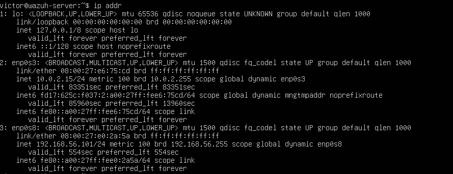
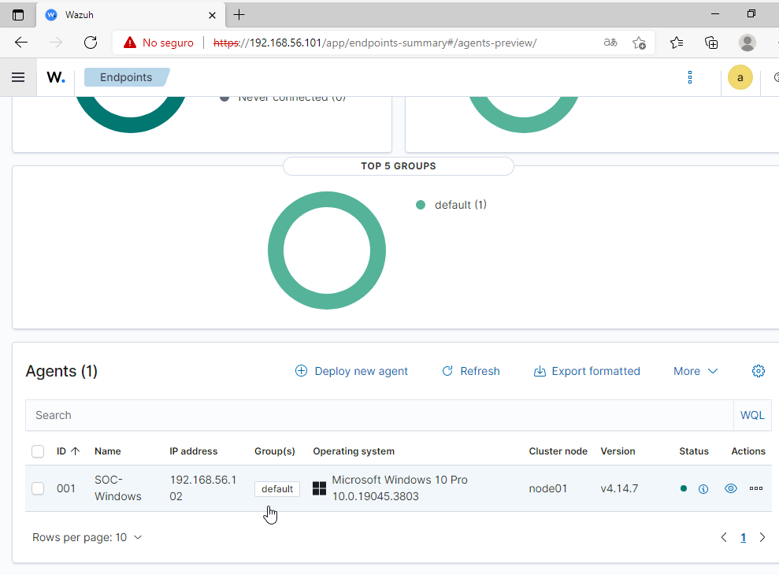
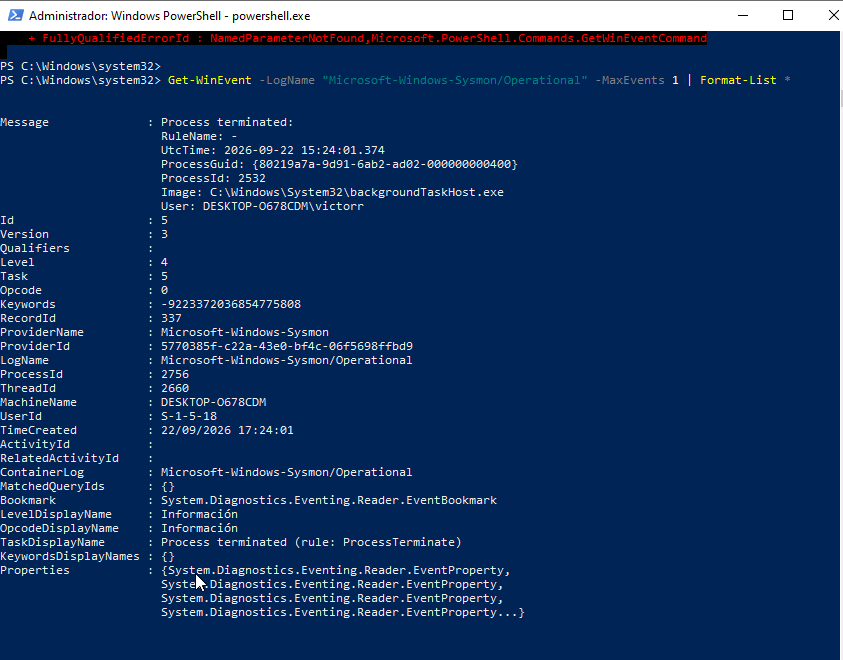
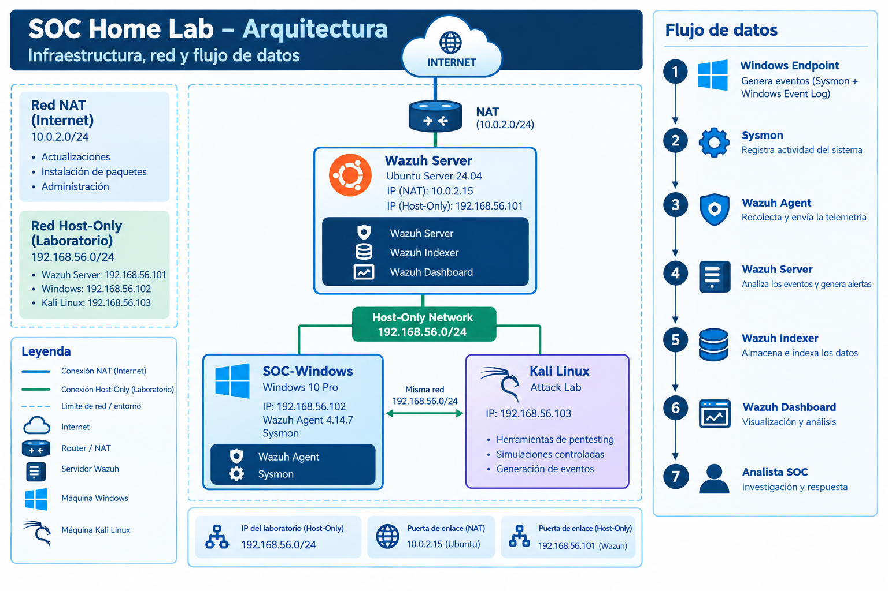
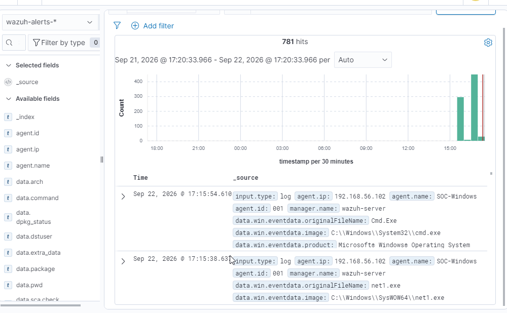

# SOC Home Lab — Architecture

## 1. Overview

This project consists of a controlled home laboratory designed to practice security monitoring, detection, investigation and incident response using a Security Operations Center (SOC) approach.

The initial environment is based on Wazuh, Windows, Sysmon and Kali Linux, deployed in an isolated virtualized network.

The laboratory is intended exclusively for educational and defensive security purposes.

---

## 2. Objectives

The main objectives of the laboratory are:

* Centralize security telemetry from endpoints.
* Monitor Windows security activity.
* Collect and analyze Sysmon events.
* Detect suspicious activity.
* Investigate security alerts.
* Identify Indicators of Compromise (IOC).
* Map observed activity to MITRE ATT&CK techniques.
* Practice incident response and remediation.
* Document investigations in a professional format.

---

## 3. Infrastructure

### 3.1 Wazuh Server

The central security platform is deployed on an Ubuntu Server virtual machine.

#### Configuration:

| Parameter | Value |
| :--- | :--- |
| Operating System | Ubuntu Server 24.04 LTS |
| CPU | 4 vCPU |
| RAM | 8 GB |
| Storage | 50 GB |
| Hostname | wazuh-server |
| Lab IP | 192.168.56.101 |

The Wazuh quickstart supports Ubuntu 24.04 and recommends 4 vCPU, 8 GiB RAM and 50 GB storage for a deployment monitoring 1–25 agents. In the all-in-one deployment, the Wazuh server, Wazuh indexer and Wazuh dashboard are installed on the same host, which Wazuh describes as suitable for labs and small environments.


*\[CAPTURA — ip addr del servidor Ubuntu mostrando enp0s3 y enp0s8 con sus IPs\]*

### 3.2 Wazuh Components

The Wazuh deployment uses the three central components:

* **Wazuh Server** — analyzes security data received from agents and generates alerts.
* **Wazuh Indexer** — indexes and stores security data.
* **Wazuh Dashboard** — provides the web interface for visualization, analysis and management.

The official Wazuh architecture documentation describes the agent as the endpoint component that collects and forwards security data to the Wazuh server. The server analyzes the events, the indexer stores/indexes the data, and the dashboard provides visualization and access to the information.

---

## 4. Windows Endpoint

A Windows virtual machine is used as the monitored endpoint.

#### Configuration:

| Parameter | Value |
| :--- | :--- |
| Operating System | Windows 10 Pro |
| Wazuh Agent | 4.14.7 |
| Host-Only IP | 192.168.56.102 |
| Agent Name | SOC-Windows |
| Wazuh Group | default |
| Status | Active |

The Wazuh agent is responsible for collecting security telemetry from the Windows endpoint and forwarding it to the Wazuh server for analysis.


*\[CAPTURA — Wazuh Dashboard → Endpoints mostrando SOC-Windows, 192.168.56.102 y estado Active\]*

---

## 5. Sysmon

Sysmon (System Monitor) is installed on the Windows endpoint to provide detailed system telemetry.

Sysmon is used to record events such as process creation and termination, network connections and other system activity. This additional telemetry can provide useful context during security investigations. Microsoft documents Sysmon as a Windows system activity monitor that writes events to the Microsoft-Windows-Sysmon/Operational event channel.

The laboratory uses Sysmon as an additional telemetry source rather than as a detection engine. Detection and analysis are performed by the Wazuh platform and the analyst.

### Sysmon event collection

The Wazuh agent is configured to collect:

* Microsoft-Windows-Sysmon/Operational

through the Windows Event Channel mechanism.

Wazuh officially documents this method for collecting Sysmon logs from Windows agents.


*\[CAPTURA — PowerShell mostrando un evento de Microsoft-Windows-Sysmon/Operational\]*

---

## 6. Network Architecture

The laboratory uses a virtualized network based on two network interfaces on the Wazuh server.

### NAT interface

The Ubuntu Wazuh server uses NAT for outbound Internet access required for system updates, package installation and controlled administration.

```text
Wazuh Server
10.0.2.15
    |
    v
  NAT
    |
Internet
```

### Host-Only interface

The second interface is used as the isolated laboratory network.

```text
192.168.56.0/24
```

The Wazuh server uses:

```text
192.168.56.101
```

and the Windows endpoint uses:

```text
192.168.56.102
```

This separates the laboratory communication from the normal Internet connection used by the server.

---

## 7. Logical Architecture



*\[CAPTURA — Diagrama de arquitectura final del laboratorio\]*


---

## 8. Data Flow

The telemetry flow of the laboratory is:

```text
Windows Endpoint
      |
      v
     Sysmon
      |
      v
Windows Event Log
      |
      v
Wazuh Agent
      |
      v
Wazuh Server
      |
      v
Wazuh Indexer
      |
      v
Wazuh Dashboard
      |
      v
Security Analyst
```

The Wazuh agent forwards events to the Wazuh server. The server analyzes the received data and the resulting data is forwarded to the indexer for indexing and storage. The dashboard is then used to query and visualize the security information.

---

## 9. Current Validation

The initial laboratory has been successfully validated:

| Component | Status |
| :--- | :--- |
| Ubuntu Server | ✅ Operational |
| Wazuh Server | ✅ Operational |
| Wazuh Indexer | ✅ Operational |
| Wazuh Dashboard | ✅ Operational |
| Windows Endpoint | ✅ Operational |
| Wazuh Agent | ✅ Active |
| Sysmon | ✅ Operational |
| Sysmon event collection | ✅ Working |
| Wazuh event visualization | ✅ Working |


*\[CAPTURA — Wazuh Discover mostrando eventos procedentes de SOC-Windows\]*

---

## 10. Security Isolation

All offensive activity planned for this laboratory will be performed inside controlled virtual machines and against intentionally selected laboratory targets.

The environment is designed to prevent experiments from being directed against production systems or external targets.

Kali Linux will be used only for controlled attack simulations against the laboratory Windows endpoint.

---

## 11. Planned Expansion

The initial architecture will be expanded with additional monitoring and investigation capabilities.

Planned components include:

```text
Kali Linux
     |
Controlled attacks
     |
     v
Windows + Sysmon
     |
     v
Wazuh
     |
     +---- Detection rules
     |
     +---- Incident investigations
     |
     +---- MITRE ATT&CK mapping
     |
     +---- IOC analysis
     |
     +---- Incident reports
```

Future use cases will include:

* Brute-force detection
* Suspicious PowerShell activity
* Network scanning
* Suspicious process execution
* Account creation
* Suspicious authentication activity

---

## 12. Project Status

Current status:

🟢 Initial SOC infrastructure operational.

Next phase:

Detection and investigation of the first controlled security incident.

