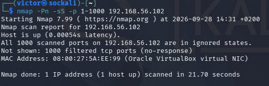
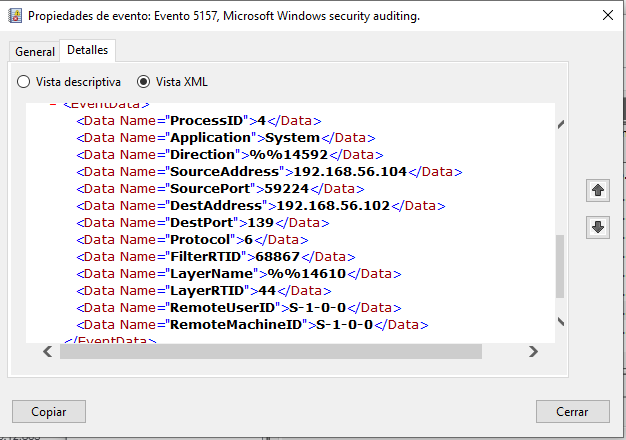
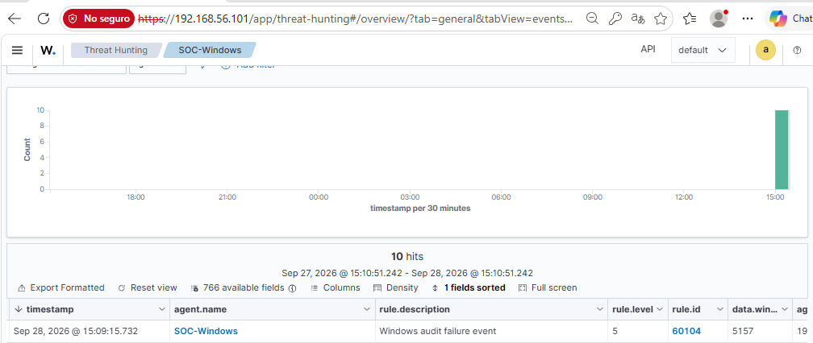

# Incident Report — INC-003

## Executive Summary

A controlled network scanning exercise was performed from Kali Linux against the Windows endpoint `SOC-Windows` inside the isolated SOC Home Lab.

The scan targeted TCP ports `1-1000` and returned all 1000 scanned ports as filtered.

Windows generated Event ID `5157` telemetry for blocked network connections, and Wazuh processed the preserved event using rule `60104`.

## Incident Details

| Field                | Value            |
| -------------------- | ---------------- |
| **Incident ID**      | `INC-003`        |
| **Incident Type**    | Network Scan     |
| **Source**           | Kali Linux       |
| **Source IP**        | `192.168.56.104` |
| **Affected Host**    | `SOC-Windows`    |
| **Target IP**        | `192.168.56.102` |
| **Windows Event ID** | `5157`           |
| **Wazuh Rule**       | `60104`          |
| **Alert Level**      | `5`              |
| **Status**           | Investigated     |
| **Environment**      | SOC Home Lab     |

## Detection

Windows Filtering Platform generated Event ID `5157` for a blocked TCP connection.

The preserved event was processed by Wazuh rule `60104`.

## Scan Activity

The controlled Nmap command was:

```bash
nmap -Pn -sS -p 1-1000 192.168.56.102
```

The scan reported:

```text
All 1000 scanned ports on 192.168.56.102 are in ignored states.
Not shown: 1000 filtered tcp ports (no-response)
```

## Technical Findings

The preserved Wazuh event records:

```text
Source:      192.168.56.104:49125
Destination: 192.168.56.102:445
Protocol:    TCP
Application: System
```

The event was generated by Windows Security Event ID `5157`.

## Timeline

The Nmap scan was executed at approximately:

`2026-09-28 14:48 CEST`

Multiple Windows Event ID `5157` records were observed between approximately `14:48` and `14:49`.

The preserved Wazuh event has the original Windows event timestamp:

`2026-09-28T13:09:09.0864532Z`

and Wazuh timestamp:

`2026-09-28T13:09:15.732+0000`

The original timestamps have been preserved.

## Analysis

The Nmap result demonstrates the controlled network scanning exercise.

The preserved Event ID `5157` demonstrates a blocked TCP connection from the Kali laboratory address to the Windows endpoint.

Because the exported Wazuh event and the Nmap execution have different timestamps, the preserved event is treated as supporting firewall telemetry rather than as a timestamp-matched record of the Nmap execution.

## Impact

The activity was restricted to the isolated SOC Home Lab.

No production systems were involved.

No compromise was identified during the controlled exercise.

## Response

The analyst:

1. Reviewed the Windows firewall telemetry.
2. Identified the source and destination addresses.
3. Reviewed the Wazuh event.
4. Performed the controlled Nmap scan.
5. Preserved the available evidence.
6. Documented the investigation.

## Mitigation

For a production environment, appropriate defensive measures could include:

* Monitoring repeated network connection attempts.
* Reviewing unexpected internal scanning activity.
* Maintaining appropriate firewall controls.
* Correlating firewall telemetry with network and endpoint data.

## Evidence

### Event Data

[`event-5157.json`](../incidents/INC-003-network-scan/evidence/events/event-5157.json)

### Log Data

[`wazuh-5157.txt`](../incidents/INC-003-network-scan/evidence/logs/wazuh-5157.txt)

### Screenshots

#### 01 - Nmap Network Scan



#### 02 - Windows Event 5157



#### 03 - Wazuh Network Scan Alert



## Conclusion

The SOC Home Lab successfully demonstrated a controlled network scanning scenario against the Windows endpoint.

The Nmap scan produced filtered TCP results, while Windows generated Event ID `5157` telemetry for blocked connections and Wazuh collected the corresponding security event.

## Classification

**Laboratory Simulation — Investigated**

