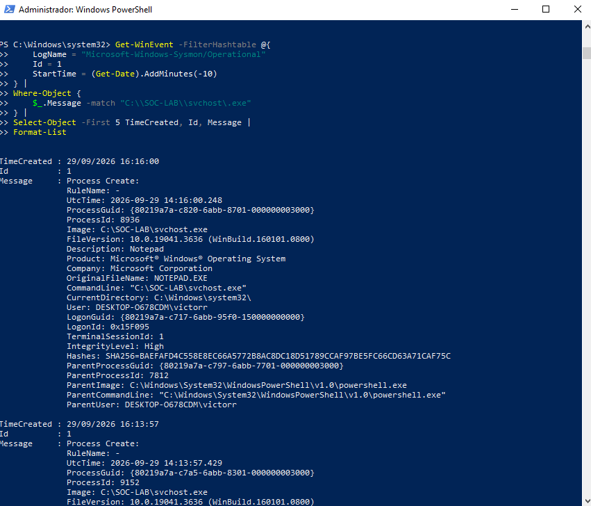
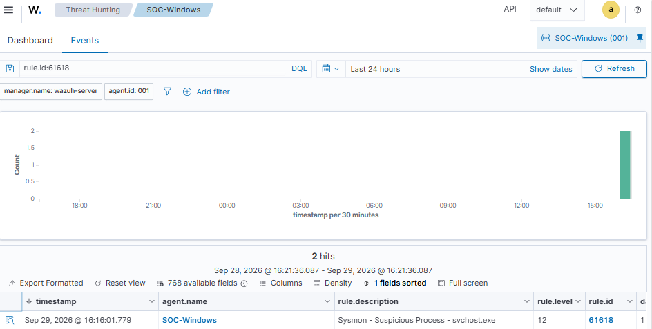

# Incident Report — INC-004

## Executive Summary
* **Evento:** Simulación controlada de un proceso sospechoso ejecutada en el endpoint de Windows `SOC-Windows` dentro de un entorno aislado de laboratorio (SOC Home Lab).
* **Acción:** Sysmon registró la creación de un proceso con nombre `svchost.exe` ubicado de forma anómala en `C:\SOC-LAB\svchost.exe`.
* **Monitoreo:** Wazuh detectó con éxito la actividad bajo la regla `61618 — Sysmon - Suspicious Process - svchost.exe`, asignándole un nivel de alerta `12`.

## Incident Details

| Campo | Valor |
| :--- | :--- |
| **Incident ID** | `INC-004` |
| **Incident Type** | Suspicious Process (Masquerading) |
| **Affected Host** | `SOC-Windows` |
| **Target IP** | `192.168.56.102` |
| **Windows Event ID** | `1` (Process Creation) |
| **Wazuh Rule** | `61618` |
| **Alert Level** | `12` |
| **Status** | Investigated |
| **Environment** | SOC Home Lab |

## Detection
* **Mecanismo:** La actividad se detectó mediante el evento ID `1` de Sysmon y fue procesada en el SIEM por la regla de Wazuh `61618`.
* **Firma de la Alerta:** `Sysmon - Suspicious Process - svchost.exe`

## Technical Findings
* **Detalle del Proceso Sospechoso:**
    * **Ruta de la Imagen:** `C:\SOC-LAB\svchost.exe`
    * **Nombre de Archivo Original:** `NOTEPAD.EXE`
    * **Descripción:** Notepad
    * **Process ID (PID):** 8936
* **Detalle del Origen:**
    * **Proceso Padre:** `C:\Windows\System32\WindowsPowerShell\v1.0\powershell.exe`
    * **Parent Process ID (PPID):** 7812
* **Hash del Archivo (SHA256):** `BAEFAFD4C558E8EC66A5772B8AC8DC18D51789CCAF97BE5FC66CD63A71CAF75C`

## Timeline
* **Creación del Proceso (Sysmon):** `2026-09-29 14:16:00.248 UTC`
* **Disparo de Alerta (Wazuh):** `2026-09-29 14:16:01.779+0000`

## Analysis
* **Hallazgo:** La telemetría recolectada demuestra que un binario cuyo nombre original de compilación es `NOTEPAD.EXE` fue renombrado y ejecutado como `svchost.exe` desde un directorio inusual (`C:\SOC-LAB\`).
* **Vector:** El proceso iniciador fue Windows PowerShell.
* **Contexto:** Al tratarse de un ejercicio intencional en laboratorio, se valida la efectividad de las reglas frente a técnicas de evasión de defensas (*Masquerading*).

## Impact
* **Alcance:** Restringido al laboratorio aislado SOC Home Lab.
* **Infraestructura:** Ningún sistema de producción real fue afectado o involucrado.
* **Persistencia:** No se identificaron actividades maliciosas adicionales asociadas al evento.

## Response
1. **Revisión** analítica de la alerta crítica en el panel de Wazuh.
2. **Identificación** y desglose del evento de creación de procesos de Sysmon.
3. **Examen** exhaustivo de la ruta de ejecución frente al *OriginalFileName*.
4. **Auditoría** del proceso padre iniciador (PowerShell).
5. **Extracción y registro** del hash SHA256 e identificadores de proceso (PID/PPID).
6. **Preservación** íntegra de los datos de eventos y logs recopilados.
7. **Documentación** formal de la investigación en este informe.

## Mitigation (Recomendaciones para Producción)
* **Monitorear** de manera estricta la ejecución de binarios del sistema desde directorios no estándar (ej. `C:\Users\`, `C:\ProgramData\`, carpetas raíz personalizadas).
* **Auditar** discrepancias entre el nombre del proceso en ejecución (`Image`) y su nombre original de compilación (`OriginalFileName`).
* **Correlacionar** binarios críticos del sistema iniciados por intérpretes de comandos como PowerShell o CMD.
* **Verificar** la reputación y firmas de hashes de archivos contra bases de inteligencia de amenazas.
* **Implementar** políticas de control de aplicaciones (AppLocker/WDAC) y el principio de mínimo privilegio.

## Evidence

### Event & Log Data
* Archivo JSON de eventos: [`event-61618.json`](../incidents/INC-004-suspicious-process/evidence/events/event-61618.json)
* Log crudo de Wazuh: [`wazuh-61618.txt`](../incidents/INC-004-suspicious-process/evidence/logs/wazuh-61618.txt)

### Screenshots
* **Captura 01:** Proceso Sospechoso en Ejecución
  
* **Captura 02:** Panel de Alertas en Wazuh
  

## Conclusion
* El entorno SOC Home Lab demostró exitosamente la capacidad de detectar un binario maliciosamente renombrado fuera de su ruta legítima.
* La integración Sysmon (Event ID 1) y Wazuh (Rule 61618) funcionó según lo esperado para este tipo de técnicas ofensivas.
* Caso cerrado con éxito como parte del aseguramiento y validación de reglas de monitoreo.

## Classification
**Laboratory Simulation — Investigated**

